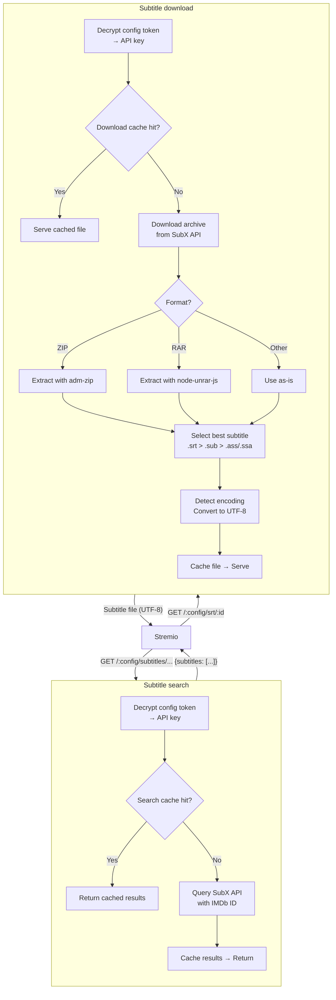

# SubmodX — Spanish Subtitles for Stremio
<p align="center">
  
</p>

**SubmodX** is a self-hostable [Stremio](https://www.stremio.com) addon that provides Spanish subtitles (`spa`) from [SubX](https://subx-api.duckdns.org) — an API wrapper around [subdivx.com](https://www.subdivx.com), the largest Spanish subtitle community.

Users bring their own SubX API key, which travels encrypted in the Stremio addon URL. No data is stored server-side.

## How it works

1. User opens the addon's `/configure` page and pastes their SubX API key.
2. The server validates the key against SubX's API. If valid, it encrypts the key using AES-256-GCM and returns a personalized manifest URL.
3. That URL is installed in Stremio. Each subtitle request decrypts the token at runtime, queries SubX, and returns results.
4. Subtitle downloads are extracted from `.zip`/`.rar` archives, auto-detected for encoding, and converted to UTF-8.

## Getting a SubX API key

1. Register at [subx-api.duckdns.org](https://subx-api.duckdns.org)
2. Go to your profile and create a new API key (free)

## Deploy

### Bare metal

Requires **Node.js 20+**.

```bash
cp .env.example .env
# Edit .env — set SECRET_WORD to a strong random string and BASE_URL to your public URL
npm install
node --env-file=.env src/index.js
```

### Docker

```bash
docker compose up -d
```

## Configuration

| Variable | Default | Description |
|---|---|---|
| `SECRET_WORD` | — | **Required.** Used to derive the AES-256-GCM key that encrypts API keys in Stremio URLs. Must not change between requests. |
| `BASE_URL` | `http://localhost:7000` | Publicly reachable URL of this addon (no trailing slash). |
| `PORT` | `7000` | HTTP listen port. |
| `SUBX_BASE_URL` | `https://subx-api.duckdns.org` | Upstream SubX API base URL. |
| `MAX_SEARCH_RESULTS` | `20` | Max subtitles returned per search. |
| `CACHE_DIR` | `./cache` (empty = RAM only) | Directory for on-disk subtitle cache. Set empty to use in-memory cache only. |
| `CACHE_SEARCH_TTL` | `900` | Search results cache TTL in seconds. |
| `CACHE_DOWNLOAD_TTL` | `86400` | Downloaded subtitle file cache TTL in seconds. |

## API (Stremio protocol)

- `GET /configure` — HTML configuration page
- `POST /api/verify-key` — Validates SubX API key, returns encrypted token
- `GET /manifest.json` — Addon manifest (no config yet, shows configure prompt)
- `GET /:config/manifest.json` — Addon manifest configured with encrypted token
- `GET /:config/subtitles/:type/:imdbId.json` — Subtitle list for an item
- `GET /:config/srt/:subtitleId` — Download a subtitle file

All unmatched routes return `{ subtitles: [] }`.

## Caching

- **Search results:** In-memory `Map` keyed by IMDb ID (configurable TTL, default 15 min).
- **Downloaded subtitles:** File cache if `CACHE_DIR` is set (default `./cache/`), otherwise in-memory `Map` (configurable TTL, default 24 h).

## Tech stack

- **Runtime:** Node.js 20+
- **Framework:** Bare [Express](https://expressjs.com) (no Stremio addon SDK)
- **Archive extraction:** `adm-zip`, `node-unrar-js`
- **Encoding detection & conversion:** `jschardet`, `iconv-lite`
- **Encryption:** built-in `crypto` module (AES-256-GCM, scrypt-derived key)

## Request flow



## License

MIT
