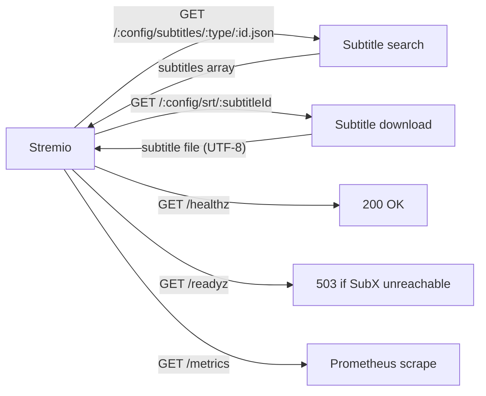
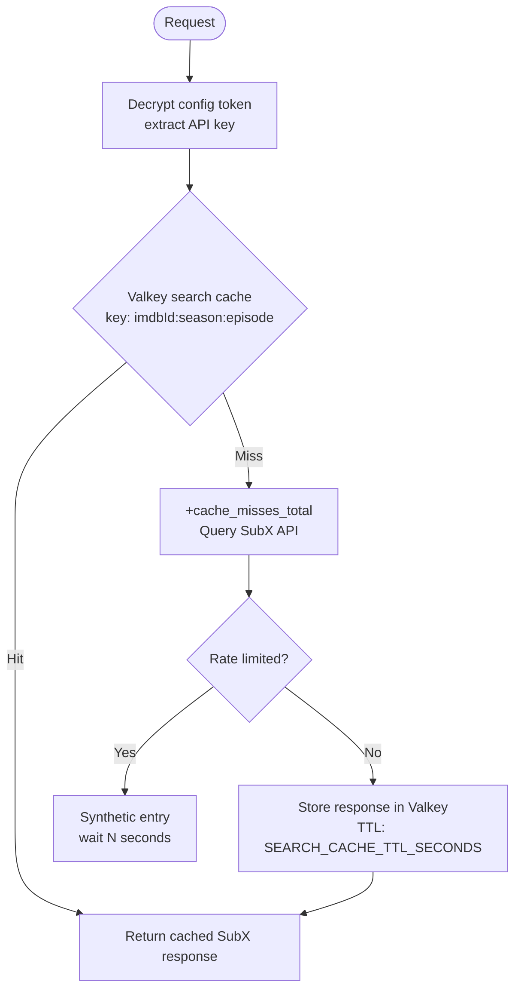
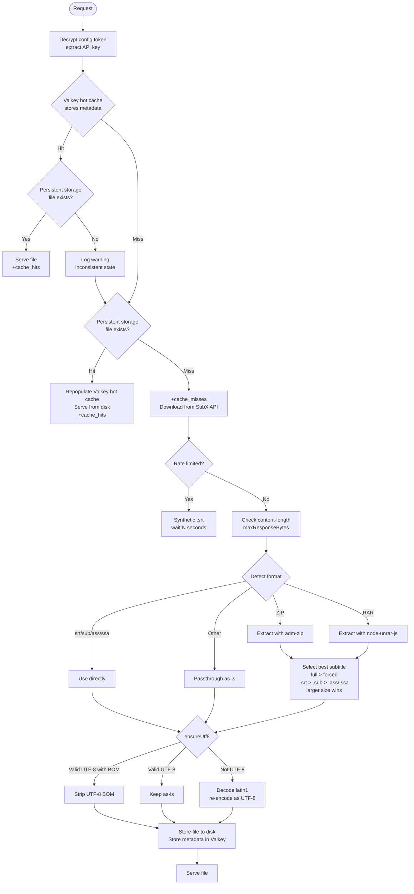

# SubmodX — Spanish Subtitles for Stremio
<p align="center">
  
</p>

**SubmodX** is a self-hostable [Stremio](https://www.stremio.com) addon that provides Spanish subtitles (`spa`) from [SubX](https://subx-api.duckdns.org) — an API wrapper around [subdivx.com](https://www.subdivx.com), the largest Spanish subtitle community.

Users bring their own SubX API key, which travels encrypted in the Stremio addon URL. No data is stored server-side.

## How it works

1. User opens the addon's `/configure` page and pastes their SubX API key.
2. The server validates the key against SubX's API. If valid, it encrypts the key using AES-256-GCM and returns a personalized manifest URL.
3. That URL is installed in Stremio. Each subtitle request decrypts the token at runtime, queries SubX, and returns results.
4. Subtitle downloads are extracted from `.zip`/`.rar` archives, validated for correct UTF-8 encoding (BOM-stripped), and transparently transcoded from latin1 to UTF-8 when needed. EXPERIMENTAL

## Getting a SubX API key

1. Register at [subx-api.duckdns.org](https://subx-api.duckdns.org)
2. Go to your profile and create a new API key (free)

## Deploy

### Bare metal

Requires **Node.js 20+** and a running **Valkey** (or Redis) instance.

```bash
cp .env.example .env
# Edit .env — set SECRET_WORD to a strong random string and BASE_URL to your public URL
npm install
node --env-file=.env src/index.js
```

### Docker

```bash
docker compose up -d
```

## Configuration

| Variable | Default | Description |
|---|---|---|
| `SECRET_WORD` | — | **Required.** Used to derive the AES-256-GCM key that encrypts API keys in Stremio URLs. Must be at least 32 characters and not change between re-runs. |
| `BASE_URL` | `http://localhost:7000` | Publicly reachable URL of this addon (no trailing slash). |
| `PORT` | `7000` | HTTP listen port. |
| `SUBX_BASE_URL` | `https://subx-api.duckdns.org` | Upstream SubX API base URL. |
| `MAX_SEARCH_RESULTS` | `20` | Max subtitles returned per search. |
| `LOG_LEVEL` | `info` | Pino log level: `trace`, `debug`, `info`, `warn`, `error`, `fatal`. |
| `VALKEY_HOST` | `valkey` | Valkey/Redis hostname. |
| `VALKEY_PORT` | `6379` | Valkey/Redis port. |
| `VALKEY_MAX_MEMORY` | `1gb` | Valkey maxmemory setting (hot cache eviction threshold). |
| `SEARCH_CACHE_TTL_SECONDS` | `900` | Search results Valkey cache TTL (15 min). |
| `SUBTITLE_CACHE_TTL_SECONDS` | `604800` | Subtitle hot cache Valkey TTL (7 days). Persistent storage is unbounded. |
| `CACHE_DIRECTORY` | `/cache/subtitles` | Directory for persistent subtitle file storage on disk. |

## API (Stremio protocol)

- `GET /configure` — HTML configuration page
- `POST /api/verify-key` — Validates SubX API key, returns encrypted token
- `GET /manifest.json` — Addon manifest (no config yet, shows configure prompt)
- `GET /:config/manifest.json` — Addon manifest configured with encrypted token
- `GET /:config/subtitles/:type/:imdbId.json` — Subtitle list for an item
- `GET /:config/srt/:subtitleId` — Download a subtitle file
- `GET /healthz` — Liveness probe (always 200)
- `GET /readyz` — Readiness probe (checks SubX upstream, 503 if degraded)
- `GET /metrics` — Prometheus metrics endpoint

All unmatched routes return `{ subtitles: [] }`.

## Caching

Two-tier cache backed by **Valkey** (hot) + **local filesystem** (persistent).

- **Search results:** Valkey, keyed by IMDb ID (default TTL 15 min).
- **Downloaded subtitles:** Valkey hot cache stores metadata (default TTL 7 days) + persistent filesystem stores the actual subtitle files. On a miss, Valkey is repopulated from disk; if both miss, a fresh download is made and stored in both tiers.
- Valkey uses `allkeys-lru` eviction — hot keys are automatically pruned under memory pressure; persistent storage is unbounded.
- App refuses to start if Valkey is unreachable.

## Tech stack

- **Runtime:** Node.js 20+
- **Framework:** Bare [Express](https://expressjs.com) (no Stremio addon SDK)
- **Cache:** [ioredis](https://github.com/redis/ioredis) (Valkey/Redis) + local filesystem
- **Archive extraction:** `adm-zip`, `node-unrar-js`
- **Encoding conversion:** `iconv-lite` (latin1 → UTF-8 fallback)
- **Encryption:** built-in `crypto` module (AES-256-GCM, scrypt-derived key)
- **Logging:** [Pino](https://getpino.io) + `pino-http`
- **Metrics:** [prom-client](https://github.com/siimon/prom-client) (Prometheus)
- **Security:** `helmet`, `express-rate-limit`, `cors`

## Request flow

### Top-level routing


```mermaid
flowchart LR
  S[Stremio]

  S -- "GET /:config/subtitles/:type/:id.json" --> SR[Subtitle search]
  S -- "GET /:config/srt/:subtitleId" --> DR[Subtitle download]
  S -- "GET /healthz" --> HZ[200 OK]
  S -- "GET /readyz" --> RZ[503 if SubX unreachable]
  S -- "GET /metrics" --> M[Prometheus scrape]

  SR -- subtitles array --> S
  DR -- "subtitle file (UTF-8)" --> S
```

### Subtitle search


```mermaid
flowchart TB
  START([Request]) --> DECRYPT[Decrypt config token<br>extract API key]

  DECRYPT --> CACHE{Valkey search cache<br>key: imdbId:season:episode}

  CACHE -- Hit --> HIT[Return cached SubX response]
  CACHE -- Miss --> MISS[+cache_misses_total<br>Query SubX API]

  MISS --> RATE{Rate limited?}
  RATE -- Yes --> SYN[Synthetic entry<br>wait N seconds]
  RATE -- No --> STORE[Store response in Valkey<br>TTL: SEARCH_CACHE_TTL_SECONDS]
  STORE --> HIT
```

### Subtitle download


```mermaid
flowchart TB
  START([Request]) --> DECRYPT[Decrypt config token<br>extract API key]

  DECRYPT --> HOT{Valkey hot cache<br>stores metadata}
  HOT -- Hit --> DISK{Persistent storage<br>file exists?}
  DISK -- Yes --> SERVE_HOT[Serve file<br>+cache_hits]
  DISK -- No --> WARN[Log warning<br>inconsistent state]

  WARN --> DISK2
  HOT -- Miss --> DISK2{Persistent storage<br>file exists?}

  DISK2 -- Hit --> REPOP[Repopulate Valkey hot cache<br>Serve from disk<br>+cache_hits]

  DISK2 -- Miss --> DOWNLOAD[+cache_misses<br>Download from SubX API]

  DOWNLOAD --> RATE{Rate limited?}
  RATE -- Yes --> SYN[Synthetic .srt<br>wait N seconds]

  RATE -- No --> CHECK[Check content-length<br>maxResponseBytes]

  CHECK --> DETECT{Detect format}
  DETECT -- ZIP --> ZIP_EX[Extract with adm-zip]
  DETECT -- RAR --> RAR_EX[Extract with node-unrar-js]
  DETECT -- "srt/sub/ass/ssa" --> DIRECT[Use directly]
  DETECT -- Other --> PASSTHROUGH[Passthrough as-is]

  ZIP_EX --> SELECT[Select best subtitle<br>full > forced<br>.srt > .sub > .ass/.ssa<br>larger size wins]
  RAR_EX --> SELECT
  DIRECT --> ENCODE
  PASSTHROUGH --> ENCODE

  SELECT --> ENCODE{ensureUtf8}

  ENCODE -- "Valid UTF-8 with BOM" --> BOM[Strip UTF-8 BOM]
  ENCODE -- "Valid UTF-8" --> KEEP[Keep as-is]
  ENCODE -- "Not UTF-8" --> LATIN1[Decode latin1<br>re-encode as UTF-8]

  BOM --> STORE_BOTH[Store file to disk<br>Store metadata in Valkey]
  KEEP --> STORE_BOTH
  LATIN1 --> STORE_BOTH

  STORE_BOTH --> SERVE[Serve file]
```

## Security

- **SECRET_WORD** must be at least 32 characters and not a common default value; app refuses to start otherwise.
- API keys travel encrypted (AES-256-GCM, scrypt-derived key) in the Stremio manifest URL.
- Token values are redacted in log output via pino-http serializers.
- Requests are rate-limited: 100 req/15min general, 5 req/15min for key verification.
- HTTP headers hardened via `helmet`.
- Upstream safety limits (hardcoded, not env-configurable):
  - `maxResponseBytes`: 20 MB — max response body accepted from SubX
  - `maxArchiveEntries`: 1000 — max files allowed inside a ZIP/RAR archive
  - `maxEntryBytes`: 10 MB — max uncompressed size per extracted file
  - `maxCompressionRatio`: 20× — max compression ratio (bomb protection)
- Filenames sanitized for path traversal; log inputs sanitized for control characters.

## Graceful shutdown

On SIGTERM the server closes the HTTP listener, drains active requests (30 s timeout), then disconnects from Valkey before exiting.

## License

MIT
